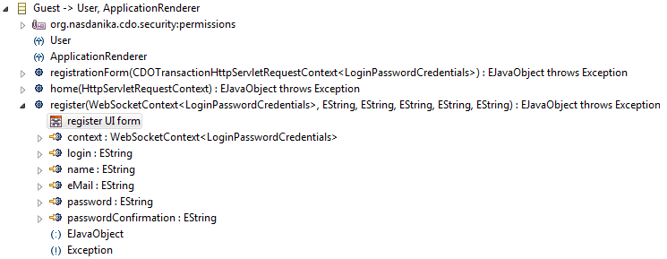
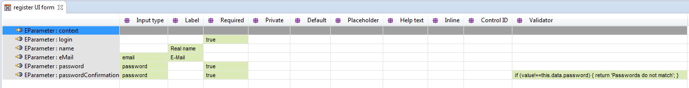
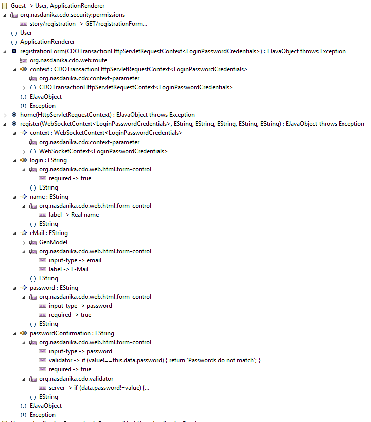

## Forms

``org.nasdanika.cdo`` bundle provides several classes for generating Bootstrap/AngularJS/KnockoutJS forms and models from EClass and EOperation metadata and annotations:

  * [[javadoc>org.nasdanika.cdo.web.html.FormGeneratorBase|FormGeneratorBase]] - Abstract base class. It has a number of protected methods which can be overridden by subclasses to fine-tune form generation. Default method implementations use metadata such as feature/parameter name and type and annotations to generate forms.
    * [EClassFormGenerator](http://www.nasdanika.org/server/apidocs/org/nasdanika/cdo/web/html/EClassFormGenerator.html) - Generates HTML/Bootstrap form from EClass metadata and annotations.
    * [EOperationFormGenerator](http://www.nasdanika.org/server/apidocs/org/nasdanika/cdo/web/html/EOperationFormGenerator.html) - Generates HTML/Bootstrap form from EOperation metadata and annotations.
    * [AngularJsFormGeneratorBase](http://www.nasdanika.org/server/apidocs/org/nasdanika/cdo/web/html/AngularJsFormGeneratorBase.html) - Abstract base class for generating forms and models to work with AngularJS.
        * [AngularJsEClassFormGenerator](http://www.nasdanika.org/server/apidocs/org/nasdanika/cdo/web/html/AngularJsEClassFormGenerator.html) - Generates HTML/Bootstrap AngularJS form and model from EClass metadata and annotations.
        * [AngularJsEOperationFormGenerator](http://www.nasdanika.org/server/apidocs/org/nasdanika/cdo/web/html/AngularJsEOperationFormGenerator.html) - Generates HTML/Bootstrap AngularJS form and model from EOperation metadata and annotations.
    * [KnockoutJsFormGeneratorBase](http://www.nasdanika.org/server/apidocs/org/nasdanika/cdo/web/html/KnockoutJsFormGeneratorBase.html) - Abstract base class for generating forms and models to work with KnockoutJS.
        * [KnockoutJsEClassFormGenerator](http://www.nasdanika.org/server/apidocs/org/nasdanika/cdo/web/html/KnockoutJsEClassFormGenerator.html) - Generates HTML/Bootstrap KnockoutJS form and model from EClass metadata and annotations.
        * [KnockoutJsEOperationFormGenerator](http://www.nasdanika.org/server/apidocs/org/nasdanika/cdo/web/html/KnockoutJsEOperationFormGenerator.html) - Generates HTML/Bootstrap KnockoutJS form and model from EOperation metadata and annotations.
  * [KnockoutJsOverlaidFormGenerator](http://www.nasdanika.org/server/apidocs/org/nasdanika/cdo/web/html/KnockoutJsOverlaidFormGenerator.html) - This class generates a container DIV with an overlay div, a form, and a form handling script.
  
### Annotations
Annotations used by the generators are:

  * ``org.nasdanika.cdo.web.html.form-control`` for EClass features - attributes and references (by default controls are not generated for references) and for EOperation parameters. This annotation supports the following details keys:
    * ``attribute:<attribute name>`` - Allows to specify control attribute. 
    * ``group-attribute:<attribute name>`` - Allows to specify group attribute. 
    * ``control-id`` - Control ID, defaults to ``<feature|parameter name>_control``.
    * ``default`` - Default value. If not set then attribute default value is used for attributes.
    * ``help-text`` - Help text. No default. In AngularJS generators help text is used to display control-level validation messages.
    * ``inline`` - Inline checkbox control if set to true.
    * ``input-type`` - One of [InputType](http://www.nasdanika.org/server/apidocs/org/nasdanika/html/HTMLFactory.InputType.html) values. Default value is computed from feature/parameter type by ``getInputType()`` methods which can be overriden.  
    * ``label`` - Control label. Defaults to feature/parameter name split by camel case with the first word capitalized and the rest
	uncapitalized. E.g. a label for ``userName`` parameter or feature would be "User name".
    * ``placeholder`` - Control placeholder for controls which support placeholders. Default is the same as for label. 
    * ``private`` - If ``true`` then feature/parameter is not included into the generated form.
    * ``required`` - Marks the generated control as required if set to ``true``.
    * ``style:<style name>`` - Allows to customize control style. E.g. ``style:background`` -> ``yellow``
    * ``group-style:<style name>`` - Allows to customize group style.
    * ``validator`` - Control validator used by AngularJS and KnockoutJS generators. The value of the ``validator`` details key shall be
  a JavaScript function body returning validation message or a promise for a validation message. If the return value is falsey, e.g. undefined
  or an empty string, then validation is successful, otherwise the return value is displayed as a control-level error message. The function
  body has access to the control value through ``value`` parameter and to the whole model through ``this``.
  * ``org.nasdanika.cdo.web.html.form`` for EClasses and EOperations. This annotation supports the following details keys:
    * ``model`` - Object declarations to add to the model definition, e.g. helper functions.
    * ``validator`` is used by AngularJS and KnockoutJS generators in generation of ``validate()`` model function. The value of the ``validator`` details key shall be
  a JavaScript function body returning validation message or a promise for a validation message. If the return value is falsey, e.g. undefined
  or an empty string, then validation is successful, otherwise the return value is displayed as a form-level error message. The function
  body has access to the model data through ``value`` parameter and to the whole model through ``this``.
    * ``inline`` - sets form as inline if value is ``true`` (case insensitive)
    * ``horizontal`` - sets form as horizontal. Value shall contain a semicolon-separated list of sizes in format ``<device size type>=<size>``, where ``device size type`` is a case-insensitive name of [UIElement.DeviceSize](http://www.nasdanika.org/server/apidocs/org/nasdanika/html/UIElement.DeviceSize.html) enum value. For example: ``LARGE=2;MEDIUM=3``.
  * ``org.nasdanika.cdo:context-parameter`` and ``org.nasdanika.cdo:service-parameter`` - parameters with these annotations are ignored because their values are computed on the server side.
 
The form control annotation can be populated with a table editor:



 
  
### AngularJS model
AngularJS generators have ``generateModel()`` method which returns JavaScript object definition with the following entries:
  * ``data`` - an object which is either empty or contains default values for features/parameters. Form controls are bound to this object's entries. 
  For existing object replace the generated ``data`` entry with the JavaScript API object. 
  * ``createData()`` - a function returning a fresh data object either empty or with default values.
  * ``clear()`` - this function sets model data to a fresh object and empties validation results.  
  * ``validationResults`` - an empty object to hold validation messages for controls.
  * ``validate()`` - a function which invokes validators for controls and the form and returns a promise of boolean value. If the promise is
  resolved with ``true`` then the form is valid.
  * ``apply(target)`` - this function is generated by ``AngularJsEOperationFormGenerator``. It invokes the target passing model data as arguments in the order in which they are defined in the ECore model.
  If ``target`` is an object with ``<operation name>`` function, then that function is invoked, otherwise ``target`` assumed to be a function to be invoked.
  * ``validateAndApply(target)`` - this function is generated by ``AngularJsEOperationFormGenerator``. It invokes ``validate()``. If validation is successful, then it invokes ``apply(target)``. ``validateAndApply`` returns a promise resolved
  with return value of ``apply()`` or rejected with ``{ validationFailed: true[, validationResults: ...] }`` if client side or server side validation failed, or ``{ targetInvocationError: <target rejection reason> }``. This function expects ``target`` 
  function to return a promise, which is the case for JavaScript API functions generated for model objects' EOperations.

### KnockoutJS model
KnockoutJS generators have ``generateModel()`` method which returns JavaScript constructor function definition with the following entries:
  * ``data`` - a property with getter and setter. The setter copies entries from the value to observables, the getter returns an object
  with its properties having getters and setters bound to observabled. 
  * ``observableData`` - an object with observables linked to ``data`` entries. Form controls are bound to this object's entries.  
  * ``clear()`` - this function sets model data undefined/default values and empties validation results.  
  * ``validationResults`` - a property similar to ``data`` setting and returning validation results.
  * ``observableValidationResults`` - an object with observables to which form error messages are bound.
  * ``validate()`` - a function which invokes validators for controls and the form and returns a promise of boolean value. If the promise is
  resolved with ``true`` then the form is valid.
  * ``apply(applyTarget)``   
    * For EOperations it invokes ``applyTarget`` passing model data as arguments in the order in which they are
    defined in the ECore model. If ``applyTarget`` is an object with ``<operation name>`` function, then that function is invoked, otherwise ``applyTarget`` assumed to be a function to be invoked.
    * For EClasses it sets ``applyTarget`` properties to data entries, then invokes ``applyTarget.$store`` function, and returns its return value.    
  * ``validateAndApply(applyTarget)`` - Invokes ``validate()``. If validation is successful, then it invokes ``apply()``. ``validateAndApply`` returns
  a promise resolved with return value of ``apply()`` or rejected with ``{ validationFailed: true[, validationResults: ...] }`` if client side
  or server side validation failed, or ``{ targetInvocationError: <target rejection reason> }``. This function expects ``applyTarget`` 
  function to return a promise, which is the case for JavaScript API functions generated for model objects' EOperations and ``$store`` function.
  * ``loadModel(source)`` is generated for EClasses only. It loads data from ``source`` to observables and can be invoked to refresh views.
  
### Case study
#### KnockoutJS - User registration
In WebTest Hub user registration can be implemented with KnockoutJS form generator or with KnockoutJsOverlaidFormGenerator. User registration story uses two operations:

  * ``registrationForm`` is a route operation which renders a registration form.
  * ``register`` processes user registration and is invoked through the JavaScrpt API. 


  
``org.nasdanika.cdo.security:permissions`` annotation on Guest class specifies that ``story/registration`` permission implies the following permissions
 
  * ``GET/registrationForm`` - allows to perform HTTP GET on the ``registrationForm`` route
  * ``invoke/register`` - allows to invoke ``register`` function through JavaScrpt API
  * ``extension/js`` - allows to use JavaScript API
   
``registrationForm`` operation is annotated as a route and its parameter is annotated as a context parameter. This operation uses Knockout operation form
generator to generate a form and a model:

##### registrationForm()

###### Using KnockoutJsOverlaidFormGenerator
```
HTMLFactory htmlFactory = context.adapt(HTMLFactory.class);
KnockoutJsOverlaidFormGenerator generator = new KnockoutJsOverlaidFormGenerator(
		HubPackage.eINSTANCE.getGuest__Register__WebSocketContext_String_String_String_String_String(), 
		htmlFactory, 
		context.getObjectPath(GuestImpl.this), 
		"window.location.href = value;", 
		"window.history.back();");
												
args[0].contentPanel(generator.generateSpinnerOverlaidFormContainer(Spinner.spinner));
```
The generator generates a form, an overlay DIV, and a script to handle the form.
When the form is submitted, the overlay is displayed over the form until a response comes from the server side.
If the server responds with an error, it is displayed in the form header. Otherwise the response value is used to navigate
the browser to the location returned by the server.

If the user clicks the "Cancel" button, the browser navigates to the previous page.  

###### Using KnockoutJsEOperationFormGenerator
This approach is more involved and shall be used in situations when the simpler approach described above is not applicable, e.g. if 
the viewModel contains not only the form, but also other elements.  

```
KnockoutJsEOperationFormGenerator formGenerator = new KnockoutJsEOperationFormGenerator(
		HubPackage.eINSTANCE.getGuest__Register__WebSocketContext_String_String_String_String_String(), 
		"model", 
		"submitHandler",
		"cancelHandler") {
	
};
			
HTMLFactory htmlFactory = context.adapt(HTMLFactory.class);
Form form = formGenerator.generateForm(htmlFactory);
GuestRegistrationGenerator<Context, String> viewModelGenerator = new GuestRegistrationGenerator<Context, String>();
String script = viewModelGenerator.execute(
		context, 
		context.getObjectPath(GuestImpl.this), 
		formGenerator.generateModel(),
		"registrationContainer");
								
args[0].contentPanel(
		htmlFactory.div(
				htmlFactory.spinnerOverlay(Spinner.spinner).id("registrationFormOverlay").style("display", "none"),
				form).id("registrationContainer"),
		htmlFactory.tag(Tag.TagName.script, script));
```

View model template from which GuestRegistrationGenerator is generated contains form processing logic which delegates to
the KnockoutJS form model generated by the form generator:

```
<%@ jet package="org.nasdanika.webtest.hub.impl" class="GuestRegistrationGenerator" skeleton="Command.skeleton"%>

<%
	T moduleName = args[0];
	T formHandler = args[1];
	T applyId = args[2];
%>

require(["<%=moduleName%>.js", 'q', 'jquery', 'knockout', 'domReady!'], function(guest, Q, jQuery, ko, doc) {
	ko.applyBindings({
		model: new <%=formHandler%>(undefined, guest),
		submitHandler: function(form) {
			var overlay = jQuery('#registrationFormOverlay')
			overlay.width(form.offsetWidth);
			overlay.height(form.offsetHeight);
			overlay.css("display", "block");		

			this.model.validateAndApply().then(function(value) {
				if (value.validationResults) {
					this.validationResults = value.validationResults;
				} else {
					window.location.href = value;
				}
				overlay.css("display", "none");
			}.bind(this.model),
			function(reason) {
				if (reason.targetInvocationError) {
					this.validationResults['$this'] = reason.targetInvocationError;
				}
				overlay.css("display", "none");
			}.bind(this.model));
		},
		cancelHandler: function() {
			window.history.back();
		}		
	}, doc.getElementById('<%=applyId%>'));

});
```

``registration()`` form control annotations were populated with a UI form table editor:   


#### registration()

``registration()`` implementation performs server-side validations, which could also be defined through ``server`` key of ``org.nasdanika.cdo.validator`` annotation, as
exemplified in ``passwordConfirmation`` parameter. If validations pass, the operation creates a new user and returns path to the Hub home page, which
redirects to the principal home page:

```
public Object register(
		WebSocketContext<LoginPasswordCredentials> context, 
		final String login, 
		String name, 
		String eMail, 
		final String password, 
		String passwordConfirmation) throws Exception {
	
	Map<String, Object> ret = new HashMap<>();
	Map<String, Object> validationResults = new HashMap<>();

	// Server-side explicit validation.
	if (login==null || login.trim().length()==0) {
		validationResults.put("login", "Login is blank");
	}
	
	if (password==null || password.trim().length()==0) {
		validationResults.put("password", "Password is blank");
	}
	
	if (passwordConfirmation==null || passwordConfirmation.trim().length()==0) {
		validationResults.put("passwordConfirm", "Password confirm is blank");
	} else if (password!=null && !password.equals(passwordConfirmation)) {
		validationResults.put("passwordConfirm", "Passwords don't match");
	}
	
	// TODO - min length, strength checks.
	
	if (!validationResults.isEmpty()) {
		ret.put("validationResults", validationResults);
		return ret;
	}		
	
	Hub hub = (Hub) eContainer();
	CDOLock writeLock = hub.cdoWriteLock();
	if (writeLock.tryLock(5, TimeUnit.SECONDS)) {
		try {
			for (User u: hub.getAllUsers()) {
				if (u instanceof LoginPasswordHashUser) {
					LoginPasswordHashUser lphUser = (LoginPasswordHashUser) u;
					if (lphUser.getLogin()!=null && lphUser.getLogin().equalsIgnoreCase(login)) {
						validationResults.put("login", "Login already exists");							
						ret.put("validationResults", validationResults);
						return ret;
					}
				}
			}
			org.nasdanika.webtest.hub.User newUser = HubFactory.eINSTANCE.createUser();
			newUser.setLogin(login);
			//newUser.setName(name); - later
			hub.setPasswordHash(newUser, password);
			hub.getUsers().add(newUser);
			
			// Permission				
			Permission permission = SecurityFactory.eINSTANCE.createPermission();
			permission.setTarget(newUser); // self-target
			permission.setAllow(true);
			permission.setName("GET");
			permission.setQualifier("/home");
			newUser.getPermissions().add(permission);				
			
			//((UserImpl) newUser).init();
			
			Principal authenticatedUser = context.authenticate(new LoginPasswordCredentials() {
				
				@Override
				public String getPassword() {
					return password;
				}
				
				@Override
				public String getLogin() {
					return login;
				}
			});
			
			if (newUser!=authenticatedUser) {
				throw new ServerException("Registration failed - server error");
			}
			
			return context.getObjectPath(hub)+".html"; 
		} finally {
			writeLock.unlock();
		}
	} 
	
	throw new org.nasdanika.web.ServerException("Cannot acquire write lock");		
}
```   
