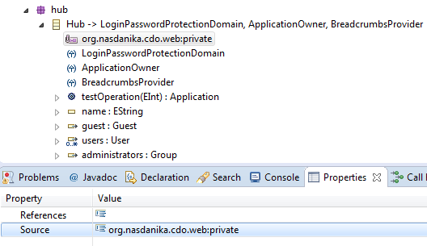
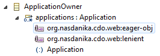
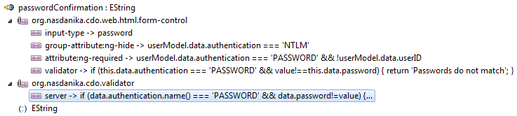

## JavaScript API

The CDO bundle provides routes which generate JavaScript API to retrieve and modify model data. The API uses 
[RequireJS](http://requirejs.org/), [Q](https://github.com/kriskowal/q). Client-server communication is done over WebSocket.

Each model object is represented by a RequireJS module. Module's URL is model object's URL with ``.js`` extension, e.g. 
``http://localhost:18080/router/transaction/elements/WebTestHub/L250.js``.
Model object's module exports a facade object with properties to access and modify object's attributes and references and functions to invoke
object's operations. JavaScript API generation for a model element (class, attribute, reference, or operation) can be suppressed by adding an
annotation to the model element with source ``org.nasdanika.cdo.web:private``.



Adding ``org.nasdanika.cdo.web:private`` to a class suppresses API generation for all class features and operations, although a module for the
class is still generated.

### Attributes
Model object attributes are generated to a facade as properties with getter and setter methods. The getter is generated if the context 
principal has ``read`` permission for the attribute. The setter is generated if the attribute is changeable, and the context principal has 
``write`` permission for the attribute. Attributes annotated with ``org.nasdanika.cdo.web:lazy`` are loaded on access, similar to lazy references (see below).

### References
Model object references are generated to a facade as properties with getter and setter methods. The getter is generated if the context 
principal has ``read`` permission for the reference. The setter is generated if the attribute is changeable, and the context principal has 
``write`` permission for the reference.

#### $container
If model object has a container and the principal has ``read`` permission for the object, then object's JavaScript facade would be generated
``$container`` lazy reference property. 

#### Loading strategies
References can be loaded using 3 strategies - eager, lazy, and preload - and 2 sub-strategies - object or reference - for eager. Loading 
strategy for a reference is determined by the reference cardinality - one or many and can be customized using annotations.

Currently attributes support only eager loading strategy. Lazy attribute loading (e.g. loading of large chunks of text or byte arrays such as 
images) will be implemented in the future.

##### Eager
###### Object
Eager object strategy is used if the reference is annotated with ``org.nasdanika.cdo.web:eager-obj``. 



With this loading strategy referenced elements are loaded before the referencing elements and reference getter returns either a facade for the 
referenced element if the reference cardinality is ``1``, or an array of functions returning facades for referenced elements if the reference 
cardinality is ``many``.

In the case of eager object circular references the getter may return a promise or some array elements may return promises. In this case use 
``Q.when()`` to handle values and promises in a uniform way.

In the code snippet below ``app`` variable is assigned an application facade:
```javascript
var app = hub.applications[0]();
```

###### Reference
Eager reference strategy is used if the reference cardinality is ``1`` or if it is annotated with ``org.nasdanika.cdo.web:eager-ref``. 

With this loading strategy referenced elements paths are loaded with the module, but the elements are loaded on access. Property getter 
returns a promise of a facade if cardinality is ``1`` or an array of functions returning promises of facades if cardinality is ``many``.

##### Lazy
Lazy strategy is used if the reference is annotated with ``org.nasdanika.cdo.web:lazy``. 

With this loading strategy a list of referenced elements paths is loaded from the server on access. 
Referenced elements are loaded after the list of paths is loaded. The reference getter returns a promise for a referenced object facade if 
the reference cardinality is ``1``, or a promise for an array of facades of referenced elements if the reference cardinality is ``many``.

##### Preload
Preload strategy is used if the reference is annotated with ``org.nasdanika.cdo.web:preload``. 

This strategy is identical to ``lazy``. The only difference is that the module accesses reference's property before exporting the facade. 
Access of the property initiates asynchronous loading of referenced elements. This strategy can be used to improve application response time 
when there is high probability that the reference will be accessed in one of next user interactions. For example, when account object is 
loaded there is high probability that its ``currentStatement`` reference will be accessed and this reference can be configured as 
``preload-obj``. 

#### Creating new objects
To create a new object set a reference property to a new object or an array of objects or modify the objects array by setting/adding objects.
Property/array element can also be set to a function. In this case function's result is used as a new object.

Object type defaults to the reference type. To override it add ``$type`` key in a format ``<type name>[@<type namespace URI>]``. 
If type namespace URI is not specified then it defaults to reference type's namespace URI.

Example:
```javascript
hub.applications.push(function() { 
	return { name: 'My application #'+hub.applications.length}; 
});
```

### Operations
Model object operations are generated as facade functions if the context principal has ``invoke`` permission for the operation. For overloaded
operations only one function is generated. Matching of the invocation to the operation is based on the operation name and the number of 
arguments. Argument type matching is not supported. 

When model operation is invoked, argument values for parameters with ``org.nasdanika.cdo:context-parameter`` annotation are 
computed by adapting the context, argument values for parameters with ``org.nasdanika.cdo:service-parameter`` parameter
are computed by looking up an OSGi service with parameter's type, an optional ``filter`` data entry can be used to specify
service filter. Other arguments are bound to the values passed from the browser.   

The operation's function returns a promise fulfilled with the return value of the operation.

Example:
```javascript
hub.testOperation(393).then(function(app) {
	console.log("Application: "+app.name+" "+app.description);
});
```

``WebSocketContext.onProgress()`` method can be used to send progress notifications to the client side. Such notifications
will be delivered to the client code through the promise notification mechanism.  

#### $delete
``$delete`` facade function is generated if the principal has ``write`` permission on the object. It allows to delete the object from its 
container. It returns a promise fulfilled with ``true`` upon operation completion.

#### $store
``$store`` facade function is generated if the principal has ``write`` permission on the object. It sends client-side session deltas to the
server (see Data exchange with the server below) and is fulfilled with the facade upon completion of data exchange with the server.

#### Getters
Operations with ``org.nasdanika.cdo.web:getter`` annotation are generated as property getters. This annnotation shall be used for 
operations which take one argument through which context is passed to the operation. If the operation name starts with ``get`` then the property name is computed by removing the ``get``
prefix and un-capitalizing the rest of the operation name, otherwise the property name equals the operation name. 

Getters check for ``read`` permission instead of ``invoke``.

#### Setters
Operations with ``org.nasdanika.cdo.web:setter`` annotation are generated as property setters. This annnotation shall be used 
operations which take two arguments - context and property value. If the operation name starts with ``set`` then the property name is computed by removing the ``set``
prefix and un-capitalizing the rest of the operation name, otherwise the property name equals the operation name.

Setters check for ``write`` permission instead of ``invoke``.

### Permission annotation
Features and operations can be annotated with ``org.nasdanika.cdo.security:permission``.
For operations the annotation can have ``action`` and ``qualifier`` keys to 
override default action (``invoke``, ``read``, or ``write``) and qualifier (operation name). For features, as they have two actions - read and write, ``read`` and ``write`` keys shall 
be used to override read and write actions respectively.

### Data exchange with the server 
The JavaScript API sends client side model modifications (deltas) to the server side when ``$store`` or any other facade function is invoked.
The API sends modifications from all client-side objects (client session) to the server. The server side applies client side deltas to the 
model, then invokes the target operation (if any, ``$store`` just stores modifications, ``$delete`` does not invoke an operation but deletes
the object from the repository), then takes server-side deltas, subtracts from them client-side deltas, and then sends remaining deltas to 
the client side where they are applied to the model.

#### Detached objects
The server side informs the client side about session object which were detached (deleted) from the repository as a result of ``$delete``
invocation, removal from their containing collection, or as a side-effect of operation invocation. The client side removes detached objects
from the collection of session objects and deletes ``$delete`` and ``$store`` functions from object's facades. 

#### Lenient and Strict policies
Model classes and references can be annotated with ``org.nasdanika.cdo.web:strict`` and ``org.nasdanika.cdo.web:lenient``. Lenient is default
for classes and strict is for references.

##### Strict
###### Class
Strict class policy ensures that when client-side deltas are applied server-side version number of the target object is the same as client-side.

###### Reference
Strict reference policy ensures that the server-side reference content is the the initial client-side content (i.e. content when reference 
was loaded) before applying deltas.

In some situations reference list modifications may fail due to constraints of the underlying list. E.g. a no duplicates constraint may prevent
list modifications where it contains duplicates in an intermediate state. In such situations create helper operations to manipulate reference
lists. 
 
##### Lenient
###### Class
Server-side/client-side version number matching is not enforced. Instead initial client-side values of attributes and references are compared
with server-side values before applying changes.  

###### Reference
If a reference is annotated as lenient, then the client side sends a list of reference modification commands to the server side - ``add``, 
``remove``, ``move``, ``set``. The server side verifies that values at command positions (where applicable) match initial values provided in 
commands. For example, ``{ type: "set", pos: 3, initialValue: "/path/one", value: { name: "New object" }}`` command will verify that the 
reference list size is at least 4 and that it has an model element with path ``path/one`` before setting creating a new object and setting
it as the reference list 4th element.  

### Custom facade definitions
Custom facade definitions can be added with ``org.nasdanika.cdo.web:facade-entries`` annotation. For each detail in the annotation a facade
entry is generated with the key and value taken from the annotation detail. The generation process iterates over supertypes and entries
defined in a subtype override entries defined in a supertype, which allows to implement client-side polymorphism.

### Required modules
``org.nasdanika.cdo.web:requires`` allows to modules required by the object module through detail entries with required module
as detail key, and parameter name as value. This annotation may be used in conjunction with custom facade definitions, e.g.
a custom facade definition may generate a chart, and chart libraries will be made available to the custom facade code
using ``org.nasdanika.cdo.web:requires`` annotation. The generation process iterates over supertypes to collect all required modules.  


### Server-side validations
``org.nasdanika.cdo.validator`` annotation allows to declaratively add server-side validations to the model. Annotation code shall be stored in
the ``server`` details entry. The annotation can be added to EOperations, EClasses, EParameters, and EStructuralFeatures (EAttributes and EReferences).
 


Validator code shall be a JavaScript function body returning String if validation fails or a falsey value (undefined, null, empty string, or nothing).

For EOperations and EParameters the code has access to ``context`` and ``invocationTarget`` variables. Value to validate is passed as ``value`` argument.
For parameter validators the argument value is passed in ``value``, for EOperation validator an object with keys corresponding to parameter
names and values to arguments is passed as ``value``. Parameter validators can access values of all arguments through ``data`` object in which arguments
are keyed by parameter names.

For EClass and EStructuralFeatures the code has access to ``context`` and ``target`` variables. Value to validate is passed as ``value`` argument.
For feature validators the feature value is passed in ``value``, for EClass validator ``target`` is passed as value.

If server-side validation fails, the transaction is marked for rollback and validation results are sent to the client. When the client code
receives non-empty validation results it rejects the ``apply`` promise with ``{ validationFailed: true, validationResults: <results from the server> }``.

Validation results have the following structure: 

```javascript
{
	operation: <operation validation results (if any)>,
	objects: {
		<object path>: <object validation result>,
		...
	}
}
```

Server-side validators can be used to parallel [form validators](forms.md), and/or to complement them by implementing
validation logic which is impossible or difficult to implement on the client side. 

### Example

```html
<html>
	<head>
		<title>Tests</title>
		<script src="/js/require.js"></script>
		<script>	
			require.config({
			    baseUrl: 'js',
			    paths: {
			        jquery: 'jquery-1.11.1.min'
			    }
			});
			require(["/router/transaction/elements/WebTestHub/L3.js"], function(hub) {
				var app = hub.applications[0]();
				console.log(app.name);
				app.testSessions.then(function (ts) {
					for (t in ts) {
						ts[t]().then(function (v) { console.log(v.title); }).done();						
					}
				}).done();
				
			});
		</script>
	</head>
	<body>
		Nothing.
	</body>
</html>
```

In this example ``L3`` model element is of type ``Hub`` with ``applications`` reference annotated with ``org.nasdanika.cdo:eager-obj``.
Application class has ``testSessions`` reference with cardinality ``many`` and default loading strategy ``lazy-ref``, i.e. its value is a
promise for an array of functions returning promises for test session facades.

### jQuery loading
This section applies to modules which require ``jquery`` dependency. 

If your application doesn't use global jQuery then you can either rename jQuery source to ``jquery.js`` or use RequireJS config, e.g.:

```javascript
require.config({
    baseUrl: '/js',
    paths: {
        jquery: 'jquery-1.11.1.min'
    }
});
```

If your application uses global jQuery, then loading jQuery by RequireJS will likely create a mess. To avoid this create ``jquery-global.js`` file as shown below (or [download](https://raw.githubusercontent.com/Nasdanika/webtest-hub/master/org.nasdanika.webtest.hub.app/WebContent/js/jquery-global.js)):

```javascript
define([], function() {
	return jQuery;
});
```

and then define RequireJS config as follows:

```javascript
require.config({
    baseUrl: '/js',
    paths: {
        jquery: 'jquery-global'
    }
});
```

### AngularJS
This section describes how to use CDO JavaScript API with AngularJS.

#### Module definition

AngularJS module and controllers shall be defined in the function passed to ``require()``, the application shall use explicit bootstraping.
The [example](https://github.com/Nasdanika/webtest-hub/blob/master/org.nasdanika.webtest.hub/templates/HubAppsController.js.jet) below
is a [Jet](https://www.eclipse.org/modeling/m2t/?project=jet) template, ``<%=argument%>`` tag is interpolated at runtime with object's path:

```javascript
<%@ jet package="org.nasdanika.webtest.hub.impl" class="ApplicationsControllerGenerator"%>

require(["<%=argument%>.js", 'q', 'jquery'], function(hub, Q, jQuery) {
	angular.module('hubApp', []).controller('ApplicationsController', ['$scope', function ($scope) {  	 
		// Controller definitions - skipped.       
	}]);
    
	angular.bootstrap(jQuery("#applicationPanel"), ['hubApp']);
}); 
```

The controller is injected into the page using code like [this](https://github.com/Nasdanika/webtest-hub/blob/master/org.nasdanika.webtest.hub/src/org/nasdanika/webtest/hub/impl/HubImpl.java#L337):
 
```java
htmlFactory.tag(TagName.script, new ApplicationsControllerGenerator().generate(context.getObjectPath(this)))
```

CDO JavaScript API uses promises as function return values (including getters), and in reference properties (see above). 
AngularJS does not automatically resolve promises and promise fulfillment values shall be applied to scope in the resolve function
and then ``$scope.$apply()`` shall be invoked to notify AngularJS about changes:

```javascript
Q.all(hub.applications.map(function(app) { return app().summaryRow })).then(function (summaryRows) {
    $scope.hubApplicationsSummary = summaryRows;
    $scope.$apply();
}).done();    
```

In the example above ``summaryRow`` is a getter function. It returns a promise. ``Q.all()`` resolves all summary row promises
into the ``summaryRows`` array. ``$scope.hubApplicationsSummary`` is assigned ``summaryRows`` array and then ``$scope.$apply`` is
invoked and summary rows are rendered as table rows:

```java
Row appRow = applicationsTable.row().ngRepeat("appSummary in hubApplicationsSummary");

Tag nameLink = htmlFactory.tag(TagName.a, "{{ appSummary.name }}").attribute("href", "#router/main/{{ appSummary.$path }}.html");
		
Button deleteButton = htmlFactory.button(htmlFactory.fontAwesome().webApplication(WebApplication.trash).getTarget()).style("float", "right");
deleteButton.ngClick("deleteApp(appSummary.$path)");
deleteButton.ngShow("appSummary.$delete");
		
appRow.cell(nameLink, "&nbsp;", deleteButton);		

appRow.cell().ngBind("appSummary.lastTest").style("text-align", "center");

appRow.cell().ngBind("appSummary.tests.pass").style("text-align", "center");
appRow.cell().ngBind("appSummary.tests.fail").style("text-align", "center");
appRow.cell().ngBind("appSummary.tests.error").style("text-align", "center");
appRow.cell().ngBind("appSummary.tests.pending").style("text-align", "center");
		
appRow.cell().ngBind("appSummary.actors.classes").style("text-align", "center");
appRow.cell().ngBind("appSummary.actors.methods").style("text-align", "center");
appRow.cell().ngBind("appSummary.actors.coverage").style("text-align", "center");

appRow.cell().ngBind("appSummary.pages.classes").style("text-align", "center");
appRow.cell().ngBind("appSummary.pages.methods").style("text-align", "center");
appRow.cell().ngBind("appSummary.pages.elements").style("text-align", "center");
appRow.cell().ngBind("appSummary.pages.coverage").style("text-align", "center");		
```

``ng-controller`` directive is added to the controller element with ``.ngController()`` method:

```java
return htmlFactory.div(
		createBreadcrumbs(context, true)).id("breadcrumbs-container").toString() +
		htmlFactory.panel(
			Style.INFO, 
			"Applications", 
			appFragment, 
			null).id("applicationPanel").ngController("ApplicationsController") +
			htmlFactory.tag(TagName.script, new ApplicationsControllerGenerator().generate(context.getObjectPath(this))) +
			htmlFactory.title(getName());
```

``appFragment`` variable contains the table with ``appRow`` from the previous code snippet. See [full method code](https://github.com/Nasdanika/webtest-hub/blob/master/org.nasdanika.webtest.hub/src/org/nasdanika/webtest/hub/impl/HubImpl.java#L265).

##### Lazy reference with getter function example
In this example ``testSessions`` is a many containment reference of ``app`` with default loading strategy - lazy reference, i.e. its value is
a promise for an array of functions (``tsAccessor``) returning promises. Each test session has ``summaryRow`` property which is backed by a getter
function and as such its value is a promise. The code below uses ``Array.map()`` to create an array of promises of summary rows - ``summaryRowPromises``.
Then ``Q.all()`` resolves all promises to values and puts them into `` summaryRows`` array, which is assigned to ``testSessionsSummary`` scope variable.
After that ``$sope.$apply()`` renders the array as a table.  

```javascript
app.testSessions.then(function(testSessions) {	
	var summaryRowPromises = testSessions.map(
   			function(tsAccessor) {
   				return tsAccessor().then(function(ts) {
   					return ts.summaryRow;
   				});
   			});
		    			 						
   	Q.all(summaryRowPromises).then(function(summaryRows) {
   		$scope.testSessionsSummary = summaryRows;
   		$scope.$apply();			
		jQuery("#testSessionsOverlay").css("display", "none");
   	}).done();
}).done();
```  

#### Progress indication with overlays
Data exchange with the server and rendering of model changes may take some time. If server interaction was initiated by a modal
dialog, the dialog may stay in place until the operation finishes, perhaps with OK and Cancel buttons disabled and a message 
indicating that work is in progress. The dialog shall be hidden in the resolve function.

In situations where server interaction is initiated without use of modal dialogs, e.g. by clicking a link or a button, overlays
can be used to cover the controller/application element to provide visual indication of work in progress and to prevent user interaction
with the application UI. HTMLFactory provides [[javadoc>org.nasdanika.html.HTMLFactory|HTMLFactory.overlay(java.lang.Object...)]]
and spinnerOverlay(org.nasdanika.html.FontAwesome.Spinner)  methods
to create overlays:

```java
Tag applicationOverlay = htmlFactory.spinnerOverlay(Spinner.refresh).id("applicationOverlay");
```

The overlay shall be added as the first child to the element which contains elements which the overlay shall cover:

```java
Tag applicationDiv = htmlFactory.div(applicationOverlay, /* ... other application elements ... */).id("applicationContainer").ngController("ApplicationsController");		
```

Add script to the page to set overlay's height and width to match its parent or the sibling which it should cover (second line creates an overlay, the last two lines
size it):

```java
return htmlFactory.div(createBreadcrumbs(context, true)).id("breadcrumbs-container").toString() +
		htmlFactory.spinnerOverlay(Spinner.cog).id("applicationOverlay") +
		htmlFactory.panel(
			Style.INFO, 
			"Applications", 
			appFragment, 
			null).id("applicationPanel").ngController("ApplicationsController") +
			htmlFactory.tag(TagName.script, new ApplicationsControllerGenerator().generate(context.getObjectPath(this))) +
			htmlFactory.title(getName()) +
			htmlFactory.tag(TagName.script, "jQuery('#applicationOverlay').width(jQuery('#applicationPanel').width());") +
			htmlFactory.tag(TagName.script, "jQuery('#applicationOverlay').height(jQuery('#applicationPanel').height());");
```  

The overlay is initally displayed. Hide it at the end of the definition of the application controller or in a resolve function:

```javascript
jQuery("#applicationOverlay").css("display", "none");
```

When a server interaction is initiated, display the overlay with a function like this:

```javascript
function showOverlay() {
	jQuery('#applicationOverlay').width(jQuery('#applicationContainer').width());
	jQuery('#applicationOverlay').height(jQuery('#applicationContainer').height());
	jQuery("#applicationOverlay").css("display", "block");		
};		
```

Then hide it in a resolve function or a helper function:

```javascript
function applyModelChanges() {
	$scope.$apply();
	jQuery("#applicationOverlay").css("display", "none");
};
```  
